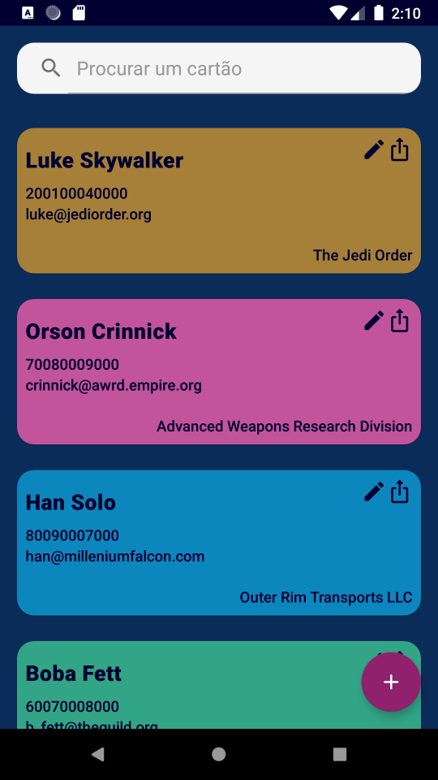
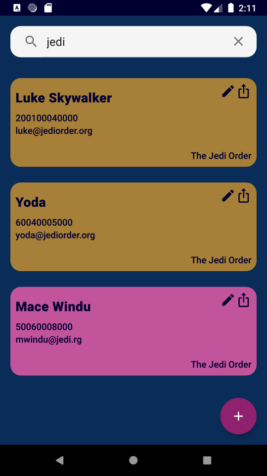

# BusinessCard by chicorasia :card_file_box:

App desenvolvido no módulo *Criando um app de cartão de visitas em Kotlin* do bootcamp Inter Android Developer na Digital Innovation One, instrutor Igor Rotondo Baglioti.

Além dos conceitos desenvolvidos nas aulas, o app emprega as seguintes tecnologias e soluções:

- **Injeção de dependências por meio da biblioteca Koin.** Adotei essa solução porque tenho bastante familiaridade com a ferramenta e acredito que deixa o código mais enxuto, além de simplificar a injeção de dependências nos ViewModels e outros componentes.
- **Arquitetura MVVM baseada em Fragments**. Optei por organizar o app em Fragments com ViewModel; a MainActivity tem somente a responsabilidade de manter o NavHostController. Adotei essa solução por ser uma arquitetura mais atual.
- **Android Navigation Component**. Optei por essa solução, em conjunto com os Fragments, porque acredito que dá mais flexibilidade e permite fluxos de navegação mais sofisticados.
- **DataBinding e Listener Bindings**. Adotei essas soluções, sempre que possível, para reduzir o acoplamento do código e ter mais flexibilidade. Com isso, os clickListeners nos Fragments foram substituídos por Listener Bindings nos arquivos de layout XML. Também adotei alguns métodos da biblioteca Transformations para vincular a visibilidade de itens a variáveis do ViewModel.
- **Boas práticas de uso de estilos, dimensions, etc.** Procurei adotar melhores práticas para a padronização dos componentes visuais nos arquivos XML, tais como o uso de estilos standard do Material Design, extração de atributos @dimen e @string e outras ferramentas, visando a uniformidade, acessibilidade e manutenabilidade do app.
- **Boas práticas UX/UI**. Apliquei princípios e componentes do Google Material Design para manter a uniformidade dos elementos visuais e a facilidade de compreensão da interface. As cores e condições de contraste e legibilidade foram verificadas por meio da ferramenta de cores em material.io. A interface foi enriquecida com hints e mensagems de feeeback para facilitar a compreensão do estado do sistema pelo usuário.
- **Persistência de dados com Room**. A gravação dos dados é feita no armazenamento interno do dispositivo por meio da biblioteca Room.
- **Corrotinas**. Uso extensivo de corrotinas para as operações de gravação na database.
- **ListAdapter e ViewHolder**. Adotei melhores práticas como a delegação das responsabilidade de inflar o layout e fazer o binding dos dados a partir da classe ViewHolder, e não nos métodos da classe ListAdapter.
- **DataBinding bidirecional**. Reduzir o acoplamento de código entre Fragment, XML e ViewModel.
- **Documentação extensiva**. Cada classe traz comentários para explicar o funcionamento e as decisões de projeto.
- **Versionamento segundo princípios de GitFlow.** 
- **Clean Architecture**

## Histórico de versões

#### Versão 0.1

Primeira versão com funcionalidades essenciais:

- Visualizar lista de cartões
- Adicionar um cartão, com os dados do contato e seletor de cores
- Compartilhar um cartão a partir da tela de home
- Remover um cartão com clique longo no item da lista

## Screenshots

****

:computer:chicorialabs.com.br/blog

****

🧡 Inter Android Developer bootcamp 2021

